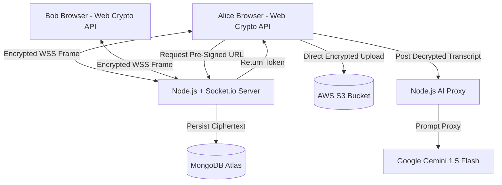

# Pulse Chat

<p align="center">
  <em>A Zero-Knowledge Real-Time Messaging Platform with Privacy-Preserving AI.</em>
</p>

## The Core Dilemma & Solution
Modern messaging apps force users into a false dichotomy: you either get smart features (like AI summaries and contextual search) but sacrifice your privacy to central servers, or you get strict End-to-End Encryption (like Signal) but lose all intelligent capabilities. 

**Pulse Chat** resolves this tension. It combines **client-side Web Crypto API cryptography (ECDH + AES-256-GCM)** with **ephemeral server-side AI proxies (Google Gemini)**, **AWS S3 pre-signed media pipelines**, and **high-concurrency WebSocket event streaming**.

## Key Features
- **100% Zero-Knowledge Privacy**: ECDH NIST P-256 key agreement + AES-256-GCM authenticated encryption done entirely in the browser. The database only ever stores Base64 ciphertext and random 12-byte IVs.
- **AI Smart Catch-Up**: Condenses 100+ unread messages into a 3-bullet summary instantly using Google Gemini 1.5 Flash. Achieved via an **Ephemeral Server Proxy** that processes text in volatile RAM and garbage-collects it immediately (0 bytes logged to disk).
- **Sub-50ms Latency**: Persistent full-duplex TCP WebSocket streaming via `Socket.io`, bypassing 800-byte HTTP polling overheads.
- **0MB Server Media Bandwidth**: Direct browser-to-S3 binary file ingestion using AWS Signature Version 4 pre-signed PUT URLs.
- **Fault-Tolerant Scheduling**: Atomic MongoDB-backed `node-cron` microservice ensuring 99.9% delivery SLA for scheduled messages, surviving arbitrary server reboots.

## System Architecture


## Tech Stack
- **Frontend**: React 18, TypeScript, Vite, Web Crypto API
- **Backend**: Node.js, Express.js, Socket.io, node-cron
- **Database**: MongoDB Atlas, Mongoose
- **Cloud & AI Integration**: AWS S3 (AWS SDK v3), Google Generative AI (Gemini Flash)
- **DevOps**: Multi-Stage Docker, GitHub Actions CI/CD, Nginx Alpine

## Getting Started (Local Development)

### Prerequisites
- Node.js (v20+)
- Docker & Docker Compose
- MongoDB Atlas cluster
- AWS Account (S3 bucket configured for CORS)
- Google Gemini API Key

### Environment Variables
Create a `.env` file in the `/backend` directory:
```env
PORT=5000
MONGO_URI=mongodb+srv://<user>:<password>@cluster0.mongodb.net/pulsechat
JWT_SECRET=your_super_secret_jwt_key
GEMINI_API_KEY=your_google_gemini_api_key

# AWS S3 Configuration
AWS_REGION=us-east-1
AWS_ACCESS_KEY_ID=your_aws_access_key
AWS_SECRET_ACCESS_KEY=your_aws_secret_key
AWS_BUCKET_NAME=your_s3_bucket_name
```

### Run with Docker Compose
The easiest way to spin up the entire full-stack application using the optimized multi-stage images:
```bash
docker-compose up --build
```
- Frontend will be available at `http://localhost:80`
- Backend API and WebSocket will be available at `http://localhost:5000`

### Run Manually (Without Docker)

**Backend:**
```bash
cd backend
npm install
npm run dev
```

**Frontend:**
```bash
cd frontend
npm install
npm run dev
```
